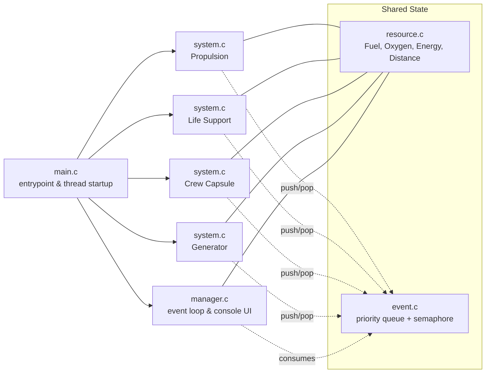

# **Multithreaded Space System Simulation**

## **Overview**

A concurrent, event-driven simulation of a spacecraft where **propulsion**, **life support**, **crew capsule**, and **generator** subsystems run in parallel and contend for shared resources (**Fuel**, **Oxygen**, **Energy**, **Distance**). A central **Manager** monitors events, adjusts system speeds, and decides when to terminate the run (e.g., **oxygen depletion** or **destination reached**). &#x20;

---

## **Architecture**



* Threads are created for the **Manager** and for each **System** using **pthreads**.&#x20;
* Resources and the event queue are protected with **POSIX semaphores** for thread-safe access. &#x20;
* The Manager renders a live **console dashboard** using ANSI escape codes and processes events to **speed up**, **slow down**, or **terminate** systems.&#x20;

---

## **Key Concepts (from the code)**

### **Subsystems run concurrently**

`main.c` initializes data, starts the manager thread, then spawns a thread per system and joins them on shutdown.&#x20;

### **Shared-resource safety**

* Each `Resource` has its own semaphore; producers/consumers acquire it before changing `amount`. &#x20;
* The `EventQueue` is guarded by a queue-level semaphore.&#x20;

### **Priority event queue**

Events (e.g., **EMPTY**, **LOW**, **CAPACITY**) are inserted **sorted by priority**, and the manager pops the **highest priority** first.&#x20;

### **Manager policy**

* Detects **Oxygen EMPTY** or **Distance at CAPACITY** → **terminate** all systems and end simulation.
* Otherwise: resource **LOW/EMPTY/INSUFFICIENT** → set relevant producers to **FAST**; **CAPACITY** → set to **SLOW**.&#x20;

### **Dynamic growth**

Arrays for **resources** and **systems** **double** capacity as elements are added (no `realloc`). &#x20;

### **Processing model**

A system:

1. **Consumes** its input (if available) under lock; otherwise emits a HIGH-priority event.
2. Simulates **processing time** that scales with status (**SLOW/FAST**).
3. **Stores** produced output respecting capacity; on overflow, emits a **CAPACITY** event.&#x20;

---

## **What’s Included (Files)**

* `defs.h` — Types, constants, and public prototypes.
* `main.c` — Entrypoint; constructs resources/systems and starts threads.&#x20;
* `manager.c` — Manager init/loop; event handling; live console display.&#x20;
* `system.c` — System lifecycle (convert, sleep, store) + dynamic array of systems.&#x20;
* `resource.c` — Resource type, semaphore, and dynamic array of resources.&#x20;
* `event.c` — Event struct + **priority queue** with semaphore (push/pop/cleanup).&#x20;
* `Makefile` — Build automation (also supports manual GCC build).

---

## **Sample Runtime**

On each update the Manager prints current **resource levels** and **system statuses**. When an event is processed you’ll see lines like:

```
Event: [Propulsion] Reported Resource [Oxygen : 0] Status [0]
Oxygen depleted. Terminating all systems.
Destination reached. Terminating all systems.
```


---

## **Building & Running**

### **Option A — Make**

```bash
make
./project2
```

*(Binary name may differ based on your Makefile rules.)*

### **Option B — Manual GCC**

```bash
gcc -std=c11 -Wall -Wextra -pthread \
  main.c manager.c system.c resource.c event.c \
  -o project2
./project2
```

---

## **Default Scenario (from `main.c`)**

* **Resources**: Fuel(1000/1000), Oxygen(20/50), Energy(30/50), Distance(0/5000).
* **Systems**:

  * **Propulsion**: consumes Fuel(5), produces Distance(25).
  * **Life Support**: consumes Energy(7), produces Oxygen(4).
  * **Crew**: consumes Oxygen(1), produces nothing.
  * **Generator**: consumes Fuel(5), produces Energy(10).&#x20;

---

## **Coursework & Metadata**

Project authored by **Daryll Giovanny Bikak Mbal** (COMP2401). Score metadata is included in `metadata.yml`. &#x20;

---

## **License**

Use freely for learning and experimentation.

